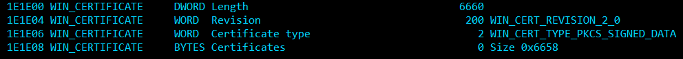

# PE walker

This is just a toy project I made while attending the course II Experto Universitario en Ingeniería Inversa e Inteligencia Malware at Universidad de Málaga. 

This code contains a parser of the PE (Portable Executable) structure. By default it prints the details of the different sections, in various colors. Here is a screenshot: 

The PE format is the executable format used in Windows, for both EXE and DLL files. [It is well documented in MSDN](https://docs.microsoft.com/en-us/windows/win32/debug/pe-format).  

This project is not meant as a full command line utility, it's more a collection of code fragments that can be used from other code to perform specific actions on executable files. I will eventually make it a library. Who knows, maybe a proper Windows GUI. Will depend on how the course evolves.

The original goal was to patch an exe file signed with authenticode and still keep the signature valid, thus the name AuthentiPatcher. There are certain places in the PE format that are not validated by the signature and they can be used to hide payloads.

## Usage

Out of the box, the program can dump the contents of the PE headers. Invoke it with the exe file you want to analyze:

    authentipatcher print c:\windows\system32\calc.exe

This will print all the fields it knows about in the console: 

### Patching files

The tool can also append a payload at the end of the certificates area, if invoked with some more arguments. The signature of the file should still be valid after this. 

    authentipatcher addauthpayload <inputfile> <payloadfile> <outputfile>

There are some requirements for this to work: 

* The payload size must be a mutiple of 8. This is required by the PE format. 
* The target executable should not have debug symbols. This is not normal in signed files, but if there are, they will be overwritten and the signature validation will fail in that case. 

It will modify the size of this section, both the length here and the size of the Certificate data diretory that points here:

## Building

The code is written in C# for dotnet core 3.1, but will probably work in previous versions (I haven't tested). Install the dotnetcore SDK in your platform and you are ready to roll. 

For console colors, it uses the great C# [Pastel library](https://github.com/silkfire/Pastel). Color ANSI codes will not be generated when the output is redirected to a file. 

## API

The interesting part is the PeParser class. Provided with a file, it will parse the PE header and the different fields can be enumerated or filtered:

        using (var parser = new PeParser(inputFile))
        {
            parser.Parse();

            var certSize = parser.Find(null, "Size of Certificate table").FirstOrDefault();
            Console.WriteLine($"Size: {certSize.ULongValue}");
            Console.WriteLine($"Offset {certSize.Offset}");
        }

## Sample output

Here is a list of the full report generated for now by the tool: 

    [i] File: c:\windows\system32\ntdll.dll
  
    OFFSET GROUP               TYPE  NAME                               VALUE(hex COMMENT
         0 DOS                 WORD  Signature                               5A4D 
         2 DOS                 BYTES BODY NOT Parsed                            0 
        3C DOS                 DWORD Pointer to PE Header                      D8 
        D8 COFF Header         DWORD Signature                               4550 
        DC COFF Header         WORD  Machine                                 8664 
        DE COFF Header         WORD  Number of sections                         9 
        E0 COFF Header         DWORD TimeDateStamp                       B29ECF52 
        E4 COFF Header         DWORD Pointer to Symbol Table                    0 
        E8 COFF Header         DWORD Number of Symbols (deprecated)             0 
        EC COFF Header         WORD  Size of optional Header                   F0 
        EE COFF Header         WORD  Characteristics                         2022 
        F0 COFF common fields  WORD  Signature                                20B PE32+
        F2 COFF common fields  WORD  Linker version                           F0E 
        F4 COFF common fields  DWORD Size of code (sum of all sections)    115800 
        F8 COFF common fields  DWORD Size of initialized data               D3600 
        FC COFF common fields  DWORD Size of uninitialized data                 0 
       100 COFF common fields  DWORD Address of entry point (RVA)               0 
       104 COFF common fields  DWORD Base of code (RVA)                      1000 
       108 Windows fields      QWORD ImageBase                          180000000 
       110 Windows fields      DWORD Section alignment                       1000 
       114 Windows fields      DWORD File alignment                           200 
       118 Windows fields      WORD  Major operating system version             A 
       11A Windows fields      WORD  Minor operating system version             0 
       11C Windows fields      WORD  Major image version                        A 
       11E Windows fields      WORD  Minor image version                        0 
       120 Windows fields      WORD  Major subsystem version                    A 
       122 Windows fields      WORD  Minor subsystem version                    0 
       124 Windows fields      DWORD Win32 version value                        0 
       128 Windows fields      DWORD Size of image                         1F0000 
       12C Windows fields      DWORD Size of headers                          400 
       130 Windows fields      DWORD Checksum (images not checked)         1ED368 
       134 Windows fields      WORD  Subsystem                                  3 
       136 Windows fields      WORD  Dll characteristics                     4160 
       138 Windows fields      QWORD Size of Stack Reserve                  40000 
       140 Windows fields      QWORD Size of Stack Commit                    1000 
       148 Windows fields      QWORD Size of Heap Reserve                  100000 
       150 Windows fields      QWORD Size of Heap Commit                     1000 
       158 Windows fields      DWORD Loader flags                               0 
       15C Windows fields      DWORD Number of RVA and sizes                   10 
       160 Data directories    DWORD Export table                          14C500 
       164 Data directories    DWORD Size of Export table                   1276A 
       168 Data directories    DWORD Import table                               0 
       16C Data directories    DWORD Size of Import table                       0 
       170 Data directories    DWORD Resource table                        17F000 
       174 Data directories    DWORD Size of Resource table                 6F310 
       178 Data directories    DWORD Exception table                       16B000 
       17C Data directories    DWORD Size of Exception table                 E0A0 
       180 Data directories    DWORD Certificate table                     1E1E00 
       184 Data directories    DWORD Size of Certificate table               6660 
       188 Data directories    DWORD Base relocation table                 1EF000 
       18C Data directories    DWORD Size of Base relocation table            528 
       190 Data directories    DWORD Debug                                 120A60 
       194 Data directories    DWORD Size of Debug                             54 
       198 Data directories    DWORD Architecture data                          0 
       19C Data directories    DWORD Size of Architecture data                  0 
       1A0 Data directories    DWORD GlobalPtr (0)                              0 
       1A4 Data directories    DWORD Size of GlobalPtr (0)                      0 
       1A8 Data directories    DWORD TLS table                                  0 
       1AC Data directories    DWORD Size of TLS table                          0 
       1B0 Data directories    DWORD Load config table                     118B10 
       1B4 Data directories    DWORD Size of Load config table                108 
       1B8 Data directories    DWORD Bound import                               0 
       1BC Data directories    DWORD Size of Bound import                       0 
       1C0 Data directories    DWORD Import address table                       0 
       1C4 Data directories    DWORD Size of Import address table               0 
       1C8 Data directories    DWORD Delay import descriptor                    0 
       1CC Data directories    DWORD Size of Delay import descriptor            0 
       1D0 Data directories    DWORD COM / CLR runtime header                   0 
       1D4 Data directories    DWORD Size of COM / CLR runtime header           0 
       1D8 Data directories    DWORD ??                                         0 
       1DC Data directories    DWORD Size of ??                                 0 
       1E0 Section .text       BYTES Name                                       0 .text   
       1E8 Section .text       DWORD Virtual size                          115406 
       1EC Section .text       DWORD Virtual address                         1000 
       1F0 Section .text       DWORD Size of raw data                      115600 
       1F4 Section .text       DWORD Pointer to raw data                      400 
       1F8 Section .text       DWORD Pointer to relocations                     0 
       1FC Section .text       DWORD Pointer to line numbers                    0 
       200 Section .text       WORD  Number of relocations                      0 
       202 Section .text       WORD  Number of line elements                    0 
       204 Section .text       DWORD Characteristics                     60000020 
       208 Section RT          BYTES Name                                       0 RT      
       210 Section RT          DWORD Virtual size                             1F9 
       214 Section RT          DWORD Virtual address                       117000 
       218 Section RT          DWORD Size of raw data                         200 
       21C Section RT          DWORD Pointer to raw data                   115A00 
       220 Section RT          DWORD Pointer to relocations                     0 
       224 Section RT          DWORD Pointer to line numbers                    0 
       228 Section RT          WORD  Number of relocations                      0 
       22A Section RT          WORD  Number of line elements                    0 
       22C Section RT          DWORD Characteristics                     60000020 
       230 Section .rdata      BYTES Name                                       0 .rdata  
       238 Section .rdata      DWORD Virtual size                           46C6A 
       23C Section .rdata      DWORD Virtual address                       118000 
       240 Section .rdata      DWORD Size of raw data                       46E00 
       244 Section .rdata      DWORD Pointer to raw data                   115C00 
       248 Section .rdata      DWORD Pointer to relocations                     0 
       24C Section .rdata      DWORD Pointer to line numbers                    0 
       250 Section .rdata      WORD  Number of relocations                      0 
       252 Section .rdata      WORD  Number of line elements                    0 
       254 Section .rdata      DWORD Characteristics                     40000040 
       258 Section .data       BYTES Name                                       0 .data   
       260 Section .data       DWORD Virtual size                            B330 
       264 Section .data       DWORD Virtual address                       15F000 
       268 Section .data       DWORD Size of raw data                        4000 
       26C Section .data       DWORD Pointer to raw data                   15CA00 
       270 Section .data       DWORD Pointer to relocations                     0 
       274 Section .data       DWORD Pointer to line numbers                    0 
       278 Section .data       WORD  Number of relocations                      0 
       27A Section .data       WORD  Number of line elements                    0 
       27C Section .data       DWORD Characteristics                     C0000040 
       280 Section .pdata      BYTES Name                                       0 .pdata  
       288 Section .pdata      DWORD Virtual size                            E0A0 
       28C Section .pdata      DWORD Virtual address                       16B000 
       290 Section .pdata      DWORD Size of raw data                        E200 
       294 Section .pdata      DWORD Pointer to raw data                   160A00 
       298 Section .pdata      DWORD Pointer to relocations                     0 
       29C Section .pdata      DWORD Pointer to line numbers                    0 
       2A0 Section .pdata      WORD  Number of relocations                      0 
       2A2 Section .pdata      WORD  Number of line elements                    0 
       2A4 Section .pdata      DWORD Characteristics                     40000040 
       2A8 Section .mrdata     BYTES Name                                       0 .mrdata 
       2B0 Section .mrdata     DWORD Virtual size                            34F0 
       2B4 Section .mrdata     DWORD Virtual address                       17A000 
       2B8 Section .mrdata     DWORD Size of raw data                        3600 
       2BC Section .mrdata     DWORD Pointer to raw data                   16EC00 
       2C0 Section .mrdata     DWORD Pointer to relocations                     0 
       2C4 Section .mrdata     DWORD Pointer to line numbers                    0 
       2C8 Section .mrdata     WORD  Number of relocations                      0 
       2CA Section .mrdata     WORD  Number of line elements                    0 
       2CC Section .mrdata     DWORD Characteristics                     C0000040 
       2D0 Section .00cfg      BYTES Name                                       0 .00cfg  
       2D8 Section .00cfg      DWORD Virtual size                               8 
       2DC Section .00cfg      DWORD Virtual address                       17E000 
       2E0 Section .00cfg      DWORD Size of raw data                         200 
       2E4 Section .00cfg      DWORD Pointer to raw data                   172200 
       2E8 Section .00cfg      DWORD Pointer to relocations                     0 
       2EC Section .00cfg      DWORD Pointer to line numbers                    0 
       2F0 Section .00cfg      WORD  Number of relocations                      0 
       2F2 Section .00cfg      WORD  Number of line elements                    0 
       2F4 Section .00cfg      DWORD Characteristics                     40000040 
       2F8 Section .rsrc       BYTES Name                                       0 .rsrc   
       300 Section .rsrc       DWORD Virtual size                           6F310 
       304 Section .rsrc       DWORD Virtual address                       17F000 
       308 Section .rsrc       DWORD Size of raw data                       6F400 
       30C Section .rsrc       DWORD Pointer to raw data                   172400 
       310 Section .rsrc       DWORD Pointer to relocations                     0 
       314 Section .rsrc       DWORD Pointer to line numbers                    0 
       318 Section .rsrc       WORD  Number of relocations                      0 
       31A Section .rsrc       WORD  Number of line elements                    0 
       31C Section .rsrc       DWORD Characteristics                     40000040 
       320 Section .reloc      BYTES Name                                       0 .reloc  
       328 Section .reloc      DWORD Virtual size                             528 
       32C Section .reloc      DWORD Virtual address                       1EF000 
       330 Section .reloc      DWORD Size of raw data                         600 
       334 Section .reloc      DWORD Pointer to raw data                   1E1800 
       338 Section .reloc      DWORD Pointer to relocations                     0 
       33C Section .reloc      DWORD Pointer to line numbers                    0 
       340 Section .reloc      WORD  Number of relocations                      0 
       342 Section .reloc      WORD  Number of line elements                    0 
       344 Section .reloc      DWORD Characteristics                     42000040 
    1E1E00 WIN_CERTIFICATE     DWORD Length                                  6660 
    1E1E04 WIN_CERTIFICATE     WORD  Revision                                 200   WIN_CERT_REVISION_2_0
    1E1E06 WIN_CERTIFICATE     WORD  Certificate type                           2   WIN_CERT_TYPE_PKCS_SIGNED_DATA
    1E1E08 WIN_CERTIFICATE     BYTES Certificates                               0   Size 0x6658
